<div align="center">



</div>

<br/>

<div align="center">

[](https://git.io/typing-svg)

</div>

<br/>

---

## `$ systemctl status akshay`

```
● akshay.service — Software Engineer
     Loaded: loaded (/usr/lib/systemd/akshay.service)
     Active: active (building) since 2024
   Main PID: 7 (A-R-K-7)

   [ ONLINE ] AI Systems & MLOps
   [ ONLINE ] Machine Learning
   [ ONLINE ] Backend Engineering
   [ ONLINE ] Quantitative / Trading Systems
   [ ONLINE ] Full-Stack Engineering
   [ ONLINE ] Real-Time Infrastructure
```

---

## `$ ./about_me`

```
NAME     : Akshay Reddy
HANDLE   : A-R-K-7
LOCATION : India

> I build systems where machine learning meets real software engineering.
  My work spans ML lifecycle platforms, AI applications, backend systems,
  real-time infrastructure, and quantitative experimentation.

  I learn by building — taking an idea from a rough prototype to something
  that actually works at the system level.

  Current focus: AI Systems · MLOps · Quant Engineering · Full-Stack
```

---

## `$ ./current_focus`

```
┌─────────────────────────────────────────────────────────┐
│                     CURRENT FOCUS                       │
├─────────────────────────────────────────────────────────┤
│                                                         │
│  > AI Systems & MLOps Platforms                         │
│  > Machine Learning & Time-Series Modeling              │
│  > Backend Architecture & Distributed Systems           │
│  > Quantitative / Algorithmic Trading Systems           │
│  > Real-Time Infrastructure & WebSocket Services        │
│  > Full-Stack Engineering (React · Spring Boot · FastAPI)│
│                                                         │
└─────────────────────────────────────────────────────────┘
```

---

## `$ ./projects --featured`

<br/>

```
┌──────────────────────────────────────────────────────────────────┐
│  NEXUSML                                          [MLOps · AI]   │
├──────────────────────────────────────────────────────────────────┤
│                                                                  │
│  AI Governance & MLOps Platform                                  │
│                                                                  │
│  $ ./nexusml --status                                            │
│                                                                  │
│  ML Lifecycle    →  End-to-end model management                 │
│  Model Registry  →  Versioning & experiment tracking            │
│  Deployment      →  Automated model serving                     │
│  Governance      →  Monitoring & observability                  │
│                                                                  │
│  STACK: Python · FastAPI · React · Node.js · MongoDB · Docker   │
│                                                                  │
└──────────────────────────────────────────────────────────────────┘
```
**→ [github.com/A-R-K-7/NexusML](https://github.com/A-R-K-7/NexusML)**

<br/>

```
┌──────────────────────────────────────────────────────────────────┐
│  TRADESPHERE                              [FinTech · Backend]    │
├──────────────────────────────────────────────────────────────────┤
│                                                                  │
│  Financial Portfolio & Trading Simulation Platform               │
│                                                                  │
│  $ ./tradesphere --status                                        │
│                                                                  │
│  Portfolio Mgmt  →  Real-time position tracking                 │
│  Market Data     →  Live analytics & charting                   │
│  Trading Engine  →  Simulation & execution logic                │
│  Backend         →  REST APIs & data persistence                │
│                                                                  │
│  STACK: Java · Spring Boot · React · JavaScript                 │
│                                                                  │
└──────────────────────────────────────────────────────────────────┘
```
**→ [github.com/A-R-K-7/TradeSphere](https://github.com/A-R-K-7/TradeSphere)**

<br/>

```
┌──────────────────────────────────────────────────────────────────┐
│  DEVFLOW                                [CI/CD · Full-Stack]    │
├──────────────────────────────────────────────────────────────────┤
│                                                                  │
│  Developer Operations & Deployment Tracking Dashboard           │
│                                                                  │
│  $ ./devflow --status                                            │
│                                                                  │
│  Deployments     →  Environment & release tracking              │
│  Real-Time       →  WebSocket-powered live status               │
│  CI/CD           →  Pipeline visibility & management            │
│  Backend         →  Spring Boot service layer                   │
│                                                                  │
│  STACK: Java · Spring Boot · React · WebSockets · Docker        │
│                                                                  │
└──────────────────────────────────────────────────────────────────┘
```
**→ [github.com/A-R-K-7/DevFlow](https://github.com/A-R-K-7/DevFlow)**

<br/>

```
┌──────────────────────────────────────────────────────────────────┐
│  STOCKML                              [Quant · ML · Research]   │
├──────────────────────────────────────────────────────────────────┤
│                                                                  │
│  Quantitative Trading Research — ML-Driven Strategy Analysis    │
│                                                                  │
│  $ ./stockml --status                                            │
│                                                                  │
│  Models          →  LSTM · time-series forecasting              │
│  Backtesting     →  Fixed vs dynamic stop-loss comparison       │
│  Risk Mgmt       →  Position sizing & drawdown analysis         │
│  Data Pipeline   →  Market data ingestion & feature eng.        │
│                                                                  │
│  STACK: Python · TensorFlow · Pandas · NumPy · Matplotlib       │
│                                                                  │
└──────────────────────────────────────────────────────────────────┘
```
**→ [github.com/A-R-K-7/StockML](https://github.com/A-R-K-7/StockML)**

<br/>

```
┌──────────────────────────────────────────────────────────────────┐
│  BEHAVIOURALCOMPANION                    [AI · Multi-Platform]  │
├──────────────────────────────────────────────────────────────────┤
│                                                                  │
│  Multi-Platform Emotional Intelligence & Behavioral Analysis    │
│                                                                  │
│  $ ./behaviouralcompanion --status                               │
│                                                                  │
│  Analysis        →  Behavioral & emotional pattern detection    │
│  Mobile          →  Flutter cross-platform client               │
│  Web             →  React frontend                              │
│  Backend         →  Spring Boot API layer                       │
│  ML              →  TensorFlow / PyTorch inference              │
│                                                                  │
│  STACK: Java · Spring Boot · Flutter · React · TF · PyTorch     │
│                                                                  │
└──────────────────────────────────────────────────────────────────┘
```
**→ [github.com/A-R-K-7/BehaviouralCompanion](https://github.com/A-R-K-7/BehaviouralCompanion)**

<br/>

```
┌──────────────────────────────────────────────────────────────────┐
│  FLATTRADEWEB — SELL AUTOMATION           [Trading · Python]    │
├──────────────────────────────────────────────────────────────────┤
│                                                                  │
│  Automated Sell-Side Trading System via FlatTrade API           │
│                                                                  │
│  $ ./flattradeweb --status                                       │
│                                                                  │
│  Automation      →  Programmatic sell order execution           │
│  API Integration →  FlatTrade brokerage API connectivity        │
│  Web Interface   →  Flask-based control dashboard               │
│                                                                  │
│  STACK: Python · Flask · REST APIs                              │
│                                                                  │
└──────────────────────────────────────────────────────────────────┘
```
**→ [github.com/A-R-K-7/FlatTradeWeb-With-Sell-Automation](https://github.com/A-R-K-7/FlatTradeWeb-With-Sell-Automation)**

---

## `$ ./tech_stack`

```
┌─────────────────────────────────────────────────────────┐
│                    ENGINEERING STACK                    │
├───────────────────┬─────────────────────────────────────┤
│ Languages         │ Python  Java  JavaScript  TypeScript │
│                   │ Dart    SQL                          │
├───────────────────┼─────────────────────────────────────┤
│ AI / ML           │ TensorFlow  PyTorch  Scikit-learn   │
│                   │ Pandas  NumPy  LSTM  XGBoost         │
├───────────────────┼─────────────────────────────────────┤
│ Backend           │ FastAPI  Spring Boot  Flask          │
│                   │ Node.js  Express  REST  WebSockets   │
├───────────────────┼─────────────────────────────────────┤
│ Frontend          │ React  Vite  Tailwind CSS            │
│                   │ Flutter (mobile)                     │
├───────────────────┼─────────────────────────────────────┤
│ Data              │ MongoDB  MySQL  PostgreSQL            │
├───────────────────┼─────────────────────────────────────┤
│ Infrastructure    │ Docker  Git  GitHub Actions  Linux   │
└───────────────────┴─────────────────────────────────────┘
```

<div align="center">


</div>

---

## `$ ./github_stats`

<div align="center">


&nbsp;


</div>

<div align="center">


</div>

---

## `$ git log --oneline`

```
a1b2c3d  (HEAD -> main) building AI governance with NexusML
d4e5f6g  full-stack trading platform — TradeSphere
h7i8j9k  ML-driven quant research — StockML backtesting
l0m1n2o  devops tracking & real-time deployments — DevFlow
p3q4r5s  behavioral AI analysis — BehaviouralCompanion
t6u7v8w  automated trading integration — FlatTradeWeb
x9y0z1a  voice AI assistant — QuantaNova
```

> *Visual representation of engineering direction — not literal git history.*

---

## `$ cat contribution_graph.txt`

<div align="center">


</div>

> *Animation generated automatically via GitHub Actions. If not visible yet, run the [snake workflow](https://github.com/A-R-K-7/A-R-K-7/actions/workflows/snake.yml) manually once after setup.*

---

## `$ echo $PHILOSOPHY`

```
> Build systems that teach you something.
> Understand what's underneath the abstractions.
> Ship → measure → improve → repeat.
> The best way to understand a system is to build one.
```

---

## `$ ./connect`

```
┌─────────────────────────────────────────────────────────┐
│                       CONNECT                           │
├─────────────────────────────────────────────────────────┤
│                                                         │
│  GitHub     →  github.com/A-R-K-7                       │
│  LinkedIn   →  linkedin.com/in/akshay-reddy-kallem    │
│                                                         │
└─────────────────────────────────────────────────────────┘
```

<div align="center">

[](https://github.com/A-R-K-7)
[](https://www.linkedin.com/in/akshay-reddy-kallem/)

</div>

---

<div align="center">


</div>
