<div align="center">


</div>

<br/>

<div align="center">

[](https://git.io/typing-svg)

</div>


---

## `$ systemctl status akshay`

```
● akshay.service — Software Engineer
     Loaded: loaded (/usr/lib/systemd/akshay.service)
     Active: active (building) since 2024
   Main PID: 7 (A-R-K-7)

   [ ONLINE ] AI Systems & MLOps
   [ ONLINE ] Machine Learning
   [ ONLINE ] Backend Engineering
   [ ONLINE ] Quantitative / Trading Systems
   [ ONLINE ] Full-Stack Engineering
   [ ONLINE ] Real-Time Infrastructure
```

---

## `$ ./about_me`

```
NAME     : Akshay Reddy
HANDLE   : A-R-K-7
LOCATION : India

> I build systems where machine learning meets real software engineering.
  My work spans ML lifecycle platforms, AI applications, backend systems,
  real-time infrastructure, and quantitative experimentation.

  I learn by building — taking an idea from a rough prototype to something
  that actually works at the system level.

  Current focus: AI Systems · MLOps · Quant Engineering · Full-Stack
```

---

## `$ ./current_focus`

```
┌─────────────────────────────────────────────────────────┐
│                     CURRENT FOCUS                       │
├─────────────────────────────────────────────────────────┤
│                                                         │
│  > AI Systems & MLOps Platforms                         │
│  > Machine Learning & Time-Series Modeling              │
│  > Backend Architecture & Distributed Systems           │
│  > Quantitative / Algorithmic Trading Systems           │
│  > Real-Time Infrastructure & WebSocket Services        │
│  > Full-Stack Engineering (React · Spring Boot · FastAPI)│
│                                                         │
└─────────────────────────────────────────────────────────┘
```

---

## `$ ./projects --featured`

<table>
<tr>
<td width="50%" align="center">

<a href="https://github.com/A-R-K-7/NexusML">

</a>

</td>
<td width="50%" align="center">

<a href="https://github.com/A-R-K-7/TradeSphere">

</a>

</td>
</tr>
<tr>
<td width="50%" align="center">

<a href="https://github.com/A-R-K-7/DevFlow">

</a>

</td>
<td width="50%" align="center">

<a href="https://github.com/A-R-K-7/StockML">

</a>

</td>
</tr>
<tr>
<td width="50%" align="center">

<a href="https://github.com/A-R-K-7/BehaviouralCompanion">

</a>

</td>
<td width="50%" align="center">

<a href="https://github.com/A-R-K-7/FlatTradeWeb-With-Sell-Automation">

</a>

</td>
</tr>
</table>

---

## `$ ./tech_stack`

```
┌─────────────────────────────────────────────────────────┐
│                    ENGINEERING STACK                    │
├───────────────────┬─────────────────────────────────────┤
│ Languages         │ Python  Java  JavaScript  TypeScript │
│                   │ Dart    SQL                          │
├───────────────────┼─────────────────────────────────────┤
│ AI / ML           │ TensorFlow  PyTorch  Scikit-learn   │
│                   │ Pandas  NumPy  LSTM  XGBoost         │
├───────────────────┼─────────────────────────────────────┤
│ Backend           │ FastAPI  Spring Boot  Flask          │
│                   │ Node.js  Express  REST  WebSockets   │
├───────────────────┼─────────────────────────────────────┤
│ Frontend          │ React  Vite  Tailwind CSS            │
│                   │ Flutter (mobile)                     │
├───────────────────┼─────────────────────────────────────┤
│ Data              │ MongoDB  MySQL  PostgreSQL            │
├───────────────────┼─────────────────────────────────────┤
│ Infrastructure    │ Docker  Git  GitHub Actions  Linux   │
└───────────────────┴─────────────────────────────────────┘
```

<div align="center">


</div>

---


## `$ git log --oneline`

```
a1b2c3d  (HEAD -> main) building AI governance with NexusML
d4e5f6g  full-stack trading platform — TradeSphere
h7i8j9k  ML-driven quant research — StockML backtesting
l0m1n2o  devops tracking & real-time deployments — DevFlow
p3q4r5s  behavioral AI analysis — BehaviouralCompanion
t6u7v8w  automated trading integration — FlatTradeWeb
x9y0z1a  voice AI assistant — QuantaNova
```

> *Visual representation of engineering direction — not literal git history.*

---

## `$ echo $PHILOSOPHY`

```
> Build systems that teach you something.
> Understand what's underneath the abstractions.
> Ship → measure → improve → repeat.
> The best way to understand a system is to build one.
```

---

## `$ ./connect`

```
┌─────────────────────────────────────────────────────────┐
│                       CONNECT                           │
├─────────────────────────────────────────────────────────┤
│                                                         │
│  GitHub     →  github.com/A-R-K-7                       │
│  LinkedIn   →  linkedin.com/in/akshay-reddy-kallem    │
│                                                         │
└─────────────────────────────────────────────────────────┘
```

<div align="center">

[](https://github.com/A-R-K-7)
[](https://www.linkedin.com/in/akshay-reddy-kallem/)

</div>

---

<div align="center">


</div>
